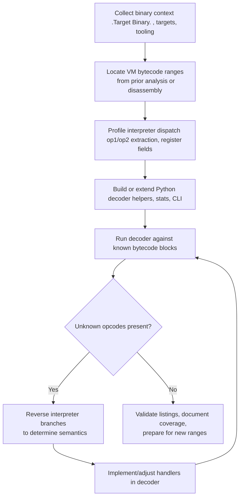

# VM Decoder Reconstruction Playbook (Template)

This document captures the reasoning paths, techniques, and concrete resources needed to reproduce the virtual-machine opcode restoration work without relying on the original session. It is written as a self-service manual for future analyses of the target VM, but the structure is generic enough to reuse for other bytecode decoders.

---

## Process Overview



---

## 1. Problem Statement

Reconstruct the complete virtual instruction set implemented inside `[Target Binary]` and produce a Python-based decoder that maps opcodes to readable mnemonics. The decoder must handle default VM targets (`[Target Function 1]`, `[Target Function 2]`, etc.) and support extending to new bytecode regions.

Key capabilities:
- Parse VM instructions from the binary.
- Record per-opcode statistics (known vs unknown).
- Emit listings comparable to hand-written assembly references.
- Iterate quickly when uncovering new opcodes (focus on op1/op2 dispatches).

---

## 2. Knowledge Prerequisites

- **Binary layout**: VM bytecode is stored inside `[Target Binary]`; offsets and sizes come from IDA/previous analysis. Default ranges:
  - `[Target Function 1]`: start `[Offset]`, size `[Size]`.
  - `[Target Function 2]`: start `[Offset]`, size `[Size]`.
- **Instruction encoding**: Each opcode is a `[N]`-bit value. Fields:
  - `op1 = [Extraction Logic]`
  - `op2 = [Extraction Logic]`
  - Register extraction via `_extract_fields`:
    - `reg_a = [Extraction Logic]`
    - `reg_b = [Extraction Logic]`
    - `reg_c = [Extraction Logic]`
    - `reg_d = [Extraction Logic]`
- **Immediate decoding**:
  - `_imm16`: combines scattered bits, optionally sign-extends.
  - `_imm26`: reuses `_imm16`, extends to 26 bits (branch offsets).
- **ARM64 register naming**: `REGISTERS_64` (`x0`..`x30`,`lr`) and matching 32-bit alias table `REGISTERS_32`.

---

## 3. Core Implementation (vm_decoder.py)

### 3.1 File layout

- `InstructionLine` dataclass: stores decoded instruction metadata and string formatter.
- `DecodeStats` dataclass: tracks known/unknown opcodes.
- `VMDecoder` class: provides decoding methods per opcode family.
- CLI entry point: uses `argparse` with `--target`, `--start`, `--size`, `--out-dir`.
- `DEFAULT_TARGETS` dictionary with built-in VM ranges.
- `emit_listing` outputs formatted listing and stats.

### 3.2 Primary workflow

1. Instantiate `VMDecoder` with bytes from `[Target Binary]`.
2. Call `decode(start, size)` to walk the byte range in steps.
3. For each opcode:
   - Compute `op1`, `op2`, registers.
   - Dispatch to handler based on `op1` (and `op2` for certain families).
   - Append `InstructionLine` objects to listing and update stats.
4. `emit_listing` writes assembly-like output and usage summary.

### 3.3 Supported opcode handlers (as of latest iteration)

| op1 | Purpose | Handler | Notes |
|-----|---------|---------|-------|
| 0x07 | `ORR imm` | `_decode_orr_imm` | Immediate ORR, unsigned imm16 |
| 0x0B | ALU/branch | `_decode_op1_0b` | Dispatch on `op2` for register ops, CMP/CSET, BR, EXIT |
| 0x0C | `B` | `_decode_branch` | Branch by imm26 << 2 |
| 0x11 | `ADD imm` | `_decode_add_imm` | Signed imm16 |
| 0x15 | `ADD imm` | `_decode_add_imm` | Alias; treat same as 0x11 |
| 0x17 | `STR x` | `_decode_store` | Signed imm16 |
| 0x18 | `B.HS` | `_decode_branch_hs` | Signed imm16 << 2 |
| 0x28 | `LDR x` | `_decode_load` | Signed imm16 |
| 0x30 | `STR w` | `_decode_store_w` | 32-bit stores |
| 0x33 | `EOR imm` | `_decode_xor_imm` | Added handler; records dynamic `op2` |
| 0x34 | `MOVZ` + `SXTW` | `_decode_movz` | Lower-word move and sign-extend |
| 0x3F | `AND imm` | `_decode_and_imm` | Added handler; records dynamic `op2` |
| 0x35 | `LDR w` | `_decode_load_w` | Added to cover vm1 operations |
| 0x39 | `STR w` (variant) | `_decode_store_w` (op1 reuse) | shares handler with 0x30 |

#### 350.101 MetaSec native VMP correction

For `douyin_35_0_0/libmetasec_ml.so.i64`, do not use the generic table above
blindly.  The `z/ws/vm64.cpp` interpreter and the focused
`vmCode=0x1F7860` trace give this corrected subset:

| low6 op | 350.101 meaning | Notes |
|---:|---|---|
| `0x00` | `LD16S` | `dst = *(int16_t *)(src+simm16)` |
| `0x02` | `LD64` | `dst = *(uint64_t *)(src+simm16)` |
| `0x08` | `LD8S` | `dst = *(int8_t *)(src+simm16)` |
| `0x0b` | `ST32_MASKED_L` | 350.101 `+0x5685c`: alignment-dependent masked word store, not legacy `ST64` |
| `0x0d` / `0x28` | `ADD64_IMM` | `dst = src+simm16` |
| `0x0e` | `ST8` | `*(src+simm16)=dst.u8` |
| `0x14` | `ST16` | `*(src+simm16)=dst.u16` |
| `0x16` | unaligned `ST32` merge | byte-aligned store/merge |
| `0x1a` / `0x0f` / `0x2d` | conditional VM-PC control | branch decision writes next VM pc state |
| `0x21` | `LD8U` | `dst = *(uint8_t *)(src+simm16)` |
| `0x2b` | `LD32S` | `dst = *(int32_t *)(src+simm16)` |
| `0x2e` | `ST32_MASKED_R` | 350.101 `+0x565e0`: alignment-dependent masked word store, not legacy `LD32` |
| `0x30` | `LD16U` | important correction: not store |
| `0x33` | `LD32U` | `dst = *(uint32_t *)(src+simm16)` |
| `0x36` | `ST32` | `*(src+simm16)=dst.u32` |
| `0x38` | `XOR_IMM` | `dst = src ^ imm16` |
| `0x3b` | `ST64` | `*(src+simm16)=dst.u64` |
| `0x13` | `ST64_MASKED_L` | 350.101 `+0x55fd4`: complementary alignment-dependent masked qword store |
| `0x3e` | `ST64_MASKED_R` | 350.101 `+0x55d20`: alignment-dependent masked qword store, not legacy `OR_IMM` |
| `0x11` | `CALL_IMM_LINK31` | VM call/jump, saves `v31 = pc+8` |

Current decoder implementing this subset:

```text
dyidre/skills/metasec_vm_trace_decoder.py
```

`_decode_op1_0b` maps `op2` values:
- `0x07`: `ORR` (register)
- `0x0C`: `ADD` (register)
- ...
- otherwise flagged unknown.

### 3.4 Stat tracking

- `DecodeStats.record_known_op1/op2` increment counters.
- Unknown opcodes recorded in sets for later reporting.
- Output lists counts per op1 and, for op1=0x0B, per op2.

### 3.5 Output format

Listings include columns:
- `pc`, `opcode`, `op1`, `op2`, `mnemonic operands`.
- Continuation lines (e.g., `CSET`, `SXTW`) mark `continuation=True` to keep indentation tidy.
- Comments describe semantic hints (e.g., `;return via lr`).

---

## 4. Running the Decoder

### 4.1 Environment setup

Create a venv (Python 3.13 recommended) and place `[Target Binary]` in workspace root.

```powershell
python -m venv .venv
.\.venv\Scripts\Activate.ps1
pip install --upgrade pip
# install any extra tooling as needed (no runtime deps for decoder itself)
```

### 4.2 Decode default targets
## 4. Running the Decoder

### 4.1 Environment setup

Create a venv (Python 3.13 recommended) and place `[Target Binary]` in workspace root.

```powershell
python -m venv .venv
.\.venv\Scripts\Activate.ps1
pip install --upgrade pip
# install any extra tooling as needed (no runtime deps for decoder itself)
```

### 4.2 Decode default targets

```powershell
.\.venv\Scripts\python.exe vm_decoder.py --target [Target 1] --out-dir decoded_test
.\.venv\Scripts\python.exe vm_decoder.py --target [Target 2] --out-dir decoded_test
```

Generated files:
- `decoded_test\[Target 1].asm`
- `decoded_test\[Target 2].asm`

Each file ends with opcode usage summary to expose missing handlers.

### 4.3 Decode custom ranges

```powershell
.\.venv\Scripts\python.exe vm_decoder.py --start [Offset] --size [Size] --out-dir decoded_custom
```

Supply values obtained from IDA or other analysis. The script validates range boundaries.
   - Implement function returning `List[InstructionLine]` and updating stats.
   - For register-immediate combos, call `_imm16` with appropriate signed flag.
   - Use `self._reg32`/`self._reg64` to format registers.
5. **Re-run decoder** to confirm stats show the opcode as known.
6. **Keep comments minimal**; only explain non-obvious translations.

### 5.2 Tips

### 5.2 Tips

- When reusing an existing handler (e.g., op1=0x39 behaves like 32-bit store), call that function directly but ensure `record_known_op1` and `record_known_op2` update correctly if `op2` is significant.
- For multi-line instructions (CMP + CSET, MOVZ + SXTW), return a list with `continuation=True` on the secondary line to maintain formatting.
- Stats rely on the actual `op2` argument: always pass it through handlers when it influences counts.
- Maintain ASCII output; avoid non-ASCII characters.
- When adding new handlers, run all default targets to verify no regressions.

---

## 6. Interpreter Correlation Strategy

Although not fully scripted here, the recommended approach to map new opcodes:
1. Open the VM interpreter function (e.g., IDA `[Interpreter Function]`).
2. Track the dispatch mechanism (likely switch/jump table on op1, nested on op2).
3. Compare the decoded instructions with actual semantics to confirm translation.
4. When ambiguous (e.g., width vs sign), look at register usage and subsequent operations.
5. Document newly-discovered behaviour in code comments sparingly, or in a companion markdown file.

---

## 7. Reference Commands and Snippets

- **Extract register fields quickly**:
  ```powershell
  .\.venv\Scripts\python.exe -c "from vm_decoder import VMDecoder; print(VMDecoder._extract_fields(0x03A10F35))"
  ```
- **Compute imm16/imm26 for debugging**:
  ```powershell
  .\.venv\Scripts\python.exe -c "from vm_decoder import VMDecoder; print(VMDecoder._imm16(0x00200339))"
  ```
- **Search decoded output** for unknown markers:
  ```powershell
  Select-String -Path decoded_test\*.asm -Pattern "UNKN"
  ```
- **Quick grep** for specific opcodes in Python:
  ```powershell
  Select-String -Path vm_decoder.py -Pattern "_decode_and_imm"
  ```

---

## 8. Validation Checklist

Before declaring the instruction set complete:
- [ ] All known VM regions decode without `UNKN` entries.
- [ ] Stats show no `Unknown op1/op2` sets.
- [ ] Newly-added handlers produce sensible mnemonics that match interpreter semantics.
- [ ] CI step: run decoder on all default targets; no exceptions thrown.

Optional additional checks:
- Compare produced listings with reference for semantic parity.
- Test script against new payloads by specifying custom ranges.

---

## 9. Open Areas for Future Work

- Extend `_decode_op1_0b` for any remaining `op2` values once interpreter analysis clarifies semantics (e.g., comparison variants, bit operations).
- Build higher-level emulation to mirror VM behaviour in Python (beyond disassembly).
- Package decoder as a module with unit tests covering each handler.
- Integrate with IDA (Python script) to annotate bytecode automatically.

---

## 10. Quick Start Recap

1. Activate Python venv and ensure `[Target Binary]` is present.
2. Run `vm_decoder.py` with desired target(s).
3. Inspect generated `.asm` listings; note unknown opcodes.
4. Use helper routines and interpreter cross-reference to implement missing handlers.
5. Repeat until `Decoded op1 usage` lists no unknowns. the analysis from scratch while replicating the reasoning that led to full opcode coverage.
